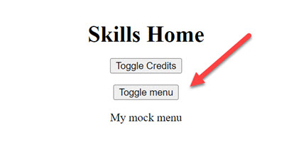

## Installation:

Create a new Project Called `ngrx-skills` and open it in VS Code:

```bash
ng n ngrx-skills-entity --routing true --style scss
```

> Note: Some Hints in this Guide assume that you are using the [NgRx Snippets - VS Code Extension](https://marketplace.visualstudio.com/items?itemName=hardikpthv.NgRxSnippets)

```bash
npm i @ngrx/store @ngrx/effects @ngrx/entity -S
npm i @ngrx/store-devtools -D
ng add @ngrx/schematics --DefaultCollection true
```

> Note: Answer the question "Do you want to use @ngrx/schematics as the default collection" with yes

## Schematics Overview

[NgRx Schematics Docs](https://ngrx.io/guide/schematics/store)

Shortcuts: a: Action, r: Reducer, ef: Effekt, se: Selector

General Syntax: ng g TYPE PATH/NAME --group

> Note: Path can be PATH/SUBPATH/Name

## Store & App State

Create Model Author interface: 
- create new folder "app/authors"
- create file "author.model.ts"

```typescript
export class Author {
  id: number = 0;
  mail: string = '';
}
```

Scaffold Store using schematics:

```bash
ng g store State --root --state-path state --module app.module.ts
```

Check the registration of the state in app.module.ts:

```typescript
imports: [
    BrowserModule,
    AppRoutingModule,
    StoreModule.forRoot(reducers, { metaReducers }),
    !environment.production ? StoreDevtoolsModule.instrument() : []
  ],
```

>Note: You might want to add other modules to `app.module.ts`

Scaffold AppState using schematics:

```bash
ng g reducer state/app --api false
```

Update `app.reducer.ts`

```typescript
export interface State {
  creditsVisible: boolean;
  menuVisible: boolean;
  title: string;
  authors: Author[];
}

export const initialState: State = {
  creditsVisible: false,
  menuVisible: true,
  title: 'ng-adv: using ngrx',
  authors: [],
};
```
Register the App State in `index.ts`. Note that we are using an alias import to avoid renaming `State` to `AppState` & `reducer` to `appReducer` by using our custom prefix: 

```typescript
import * as app from './app.reducer';

export interface State {
  app: app.State;
}

export const reducers: ActionReducerMap<State> = {
  app: app.reducer,
};
```

>Note: State of Lazy Loaded modules with be authmatically added to the `root state` and  `ActionReducerMap`

Add a new home component 

```
ng g c home --skipTests -d
```

Add [Angular Flex Layout](https://github.com/angular/flex-layout)

```
npm i -s @angular/flex-layout @angular/cdk
```

Import Angular Flex Layout to app.module

```typescript
. . .
import { FlexLayoutModule } from '@angular/flex-layout';

@NgModule({
  declarations: [
    AppComponent,
    HomeComponent
  ],
  imports: [
    BrowserModule,
    AppRoutingModule,
    FlexLayoutModule, 
    ...
```

To add actions we will use an extension with snippets which is more handy that the ngrx schematics. To begin create a file `state/app.actions.ts`. 

Add the following extension to Visual Studio Code:

```bash
code --install-extension mikael.angular-beastcode
```

Implement the Actions `toggleCredits`, `toggleMenu` and `setTitle`. Note the setTitle will take a param of type string.

```typescript
export const toggleMenu = createAction('[App] toggleMenu');
export const toggleCredits = createAction('[App] toggleCredits');
export const setTitle = createAction(
  '[App] setTitle',
  props<{ title: string }>()
);
```

Implement the reducer by updating the `const reducer` in `app.reducer.ts`. Note that each action will create an `on-block` and might reference its action params:

```typescript
export const reducer = createReducer(
  initialState,
  on(toggleMenu, (state, action) => {
    return { ...state, menuVisible: !state.menuVisible };
  }),
  on(toggleCredits, (state, action) => {
    return { ...state, creditsVisible: !state.creditsVisible };
  }),
  on(setTitle, (state, action) => {
    return { ...state, title: action.title };
  })
);
```

Create Selectors:

```
ng g selector state/app
```

Add the following to `app.selectors.ts`:

```typescript
export const getAppState = createFeatureSelector<State>(appFeatureKey);

export const getMenuVisible = createSelector(
  getAppState,
  (state: State) => state.menuVisible
);

export const getCreditsVisible = createSelector(
  getAppState,
  (state: State) => state.creditsVisible
);

export const getTitle = createSelector(
  getAppState,
  (state: State) => state.title
);
```

>Note: Make sure you import `State` from the reducer file and not from ngrx

Use in `home.component.ts`:

```typescript
. . .
import { getCreditsVisible, getMenuVisible } from '../store/selectors/app.selectors';

. . .
export class HomeComponent implements OnInit {
  constructor(public store: Store<AppState>) {}

  creditsVisible = this.store.select(getCreditsVisible);
  menuVisible = this.store.select(getMenuVisible);

  ngOnInit(): void {}

  toggleCredits(): void {
    this.store.dispatch(new ToggleCredits());
  }

  toggleMenu(): void {
    this.store.dispatch(new ToggleMenu());
  }
```

Clean the app.component.html. Add the following content to `home.component.ts`:

```html
<div fxLayout="column" fxLayoutAlign="center center" fxLayoutGap="16px">
  <h1>Skills Home</h1>

  <button mat-raised-button (click)="toggleCredits()" color="primary">
    Toggle Credits
  </button>

  <div
    *ngIf="creditsVisible | async"
    fxLayout="column"
    fxLayoutAlign="center center"
    fxLayoutGap="16px"
  >
     Authors list will show up here
  </div>

  <button mat-raised-button (click)="tobbleMenu()" color="primary">
    Toggle menu
  </button>

  <div *ngIf="menuVisible | async">My mock menu</div>
</div>
```

You should be able to toggle the credits now:



Install Redux DevTools Chrome Browser Extension and view the Actions and State Diff.

## Using Effects to load data

Install Effects Lib:

```
npm install @ngrx/effects -S
```

Add data to db.json at project root level:

```json
{
  "authors": [
    {
      "id": 1,
      "mail": "alexander.pajer@integrations.at"
    },
    {
      "id": 3,
      "mail": "giro.thegalgo@integrations.at"
    }
  ]
}
```

Add author actions to `app.actions.ts`:

```typescript
export const loadAuthors = createAction('[App] loadAuthors');
export const loadAuthorsSuccess = createAction(
  '[App] loadAuthors Success',
  props<{ item: Author[] }>()
);
export const loadAuthorsFailure = createAction(
  '[App] loadAuthors Failure',
  props<{ err: Error }>()
);
```

Update `app.selectors.ts` to reflect authors data:

```typescript
export const getAuthors = createSelector(
  getAppState,
  (state: State) => state.authors
);
```

Update app.reducer.ts to handle successful loading of author data:

```typescript
on(loadAuthorsSuccess, (state, action) => {
  return { ...state, authors: action.items };
})
```

Implement Authors Service:

```
 ng g s authors/authors --skipTests
```

```typescript
export class AuthorService {
  constructor(private httpClient: HttpClient) {}

  getAuthors(): Observable<Author[]> {
    return this.httpClient.get<Author[]>(`${environment.api}authors`);
  }
}
```

Make sure the requirements for the AuthorService are present:

- Add api in environment.ts with value 'http://localhost:3000/'
- Add HttpClientModule to the app.module

Add loadAuthors effect:

```
ng g effect state/app --module app.module.ts

? To which module (path) should the effect be registered in? .
? Should we wire up success and failure actions? No
? Do you want to use the create function? No
```

Update app.effects.ts:

```typescript
@Injectable()
export class AppEffects {
  constructor(private actions$: Actions, private service: AuthorService) {}

  loadDemos$ = createEffect(() =>
    this.actions$.pipe(
      ofType(loadAuthors),
      mergeMap(() =>
        this.service.getAuthors().pipe(
          map((data) => ({
            type: '[App] loadAuthors Success',
            items: data,
          })),
          catchError((err) => of(loadAuthorsFailure({ err })))
        )
      )
    )
  );
}
```

### Add an authors list & add it to `home.component.ts`:

```
ng g c authors/authors-list -m app --flat --skipTests 

CREATE src/app/authors/authors-list.component.html (27 bytes)
CREATE src/app/authors/authors-list.component.ts (299 bytes)
CREATE src/app/authors/authors-list.component.scss (0 bytes)
UPDATE src/app/app.module.ts (1239 bytes)
```

Add the following html & \*.ts:

```html
<div fxLayout="column" fxLayoutAlign="center center" fxLayoutGap="16px">
  <h2>Credits:</h2>
  <div *ngFor="let a of authors | async">{{ a.mail }}</div>
</div>
```

```typescript
constructor(private store: Store<AppState>) {}
authors = this.store.select(getAuthors);

ngOnInit(): void {
  this.store.dispatch(new LoadAuthors());
}
```

Add the following HTML to home.components.html:

```html
<div
  *ngIf="creditsVisible | async"
  fxLayout="column"
  fxLayoutAlign="center center"
  fxLayoutGap="16px"
>
  <div><app-authors-list></app-authors-list></div>
</div>
```

## Lazy Loaded Feature Module with NgRx Entity, Facades and Creator Functions

Create a lazy loaded skills module:

```
ng g module skills --route skills --module app.module.ts
```

Creator Functions:

- createAction
- createEffect

Add Food Data to db.json & create a skill.model.ts:

```json
"skills": [
  { "id": "123", "name": "rxjs", "completed": true },
  { "id": "456", "name": "ngrx", "completed": false }
]
```

### Creator Functions

Add NgRx Entity:

```
npm i -S @ngrx/entity
```

Add Skill-Components:

```
ng g c skills/skills-container
ng g c skills/skills-list-with-row
ng g c skills/skill-row
```

Add Skill State & Reducer:

```
ng g r skills/store/skills --group
? Should we add success and failure actions to the reducer? Yes
? Do you want to use the create function? Yes
CREATE src/app/skills/store/reducers/skills.reducer.spec.ts (336 bytes)
CREATE src/app/skills/store/reducers/skills.reducer.ts (239 bytes)
```

Then add the state skills data.

Our State should look like this:

```typescript
export const skillsFeatureKey = 'skills';

export interface SkillsState {
  skills: Skill[];
}

export const initialState: SkillsState = {
  skills: [],
};

export const reducer = createReducer(
  initialState,

);
```

Add Skill Effect:

```
ng g ef skills/store/skills --group

? To which module (path) should the effect be registered in? skills
? Should we wire up success and failure actions? No
? Do you want to use the create function? No
CREATE src/app/skills/store/effects/skills.effects.spec.ts (584 bytes)
CREATE src/app/skills/store/effects/skills.effects.ts (189 bytes)
UPDATE src/app/skills/skills.module.ts (819 bytes)
```

Check the skills.module.ts to make sure the skills state is loaded:

```typescript
@NgModule({
  declarations: [SkillsContainerComponent, SkillsListComponent, SkillsKpiComponent],
  imports: [
    CommonModule,
    SkillsRoutingModule,
    StoreModule.forFeature(skillsFeatureKey, reducer),
    EffectsModule.forFeature([SkillsEffects]),
  ],
})
```

Add Skill Selector:

```
ng g se skills/store/skills --group
```

Add a service that we will use as a Facade:

```
ng g s skills/store/facades/skills-facade
```

> Note: You will need to implement the service CRUD using `http://localhost:3000/skills`

```
ng g s skills/model/skills
```

```typescript
import { tap } from 'rxjs/operators';
import { environment } from 'src/environments/environment';
import { Skill } from './skill.model';

@Injectable({
  providedIn: 'root'  // if only used in lazy loaded module means the service is also lazy loaded.
})
export class SkillsService {

  constructor(private httpClient: HttpClient) { }

  getSkills(): Observable<Skill[]> {
    return this.httpClient
      .get<Skill[]>(environment.apiUrl + "authors")
      .pipe(tap(data => console.log("data from api", data)));
  }
}
```

> Note: Read more about [providedIn: 'root'](https://angular.io/guide/providers#providing-a-service) and [this blog post](https://dev.to/nickraphael/angular-s-providedin-root-what-if-two-lazy-modules-provided-the-same-service-166p)

### Skills Feature Module Implementation

Add the Skill Actions & answer Schematic Params accodingly:

```
ng g a skills/store/skills --group

? Should we generate success and failure actions? Yes
? Do you want to use the create function? Yes
CREATE src/app/skills/store/actions/skills.actions.spec.ts (204 bytes)
CREATE src/app/skills/store/actions/skills.actions.ts (347 bytes)
```


We now have saved us from writing a lot of boilerplate & just have to correct the Type of Success and Failure

```typescript
export const loadSkills = createAction('[Skills] Load Skills');

export const loadSkillsSuccess = createAction(
  '[Skills] Load Skills Success',
  props<{ skills: Skill[] }>()
);

export const loadSkillsFailure = createAction(
  '[Skills] Load Skills Failure',
  props<{ error: Error }>()
);
```

Other needed actions can be created using the ngrx code snippets:

```

// addSkill action -> easy creation using: ngrx-create-action-props
export const addSkill = createAction('[Skills] Add', props<{ data: Skill }>());

export const addSkillsSuccess = createAction(
  '[Skills] Add Skills Success',
  props<{ skill: Skill }>()
);

export const addSkillsFailure = createAction(
  '[Skills] Add Skills Failure',
  props<{ error: Error }>()
);

/*
// just a mock to save time - not persisted
export const toggleSkillComplete = createAction(
  '[Skill] Toggle Skill Complete',
  props<{ skill: Skill }>()
);

// just a mock to save time - not persisted
export const deleteSkill = createAction(
  '[Skills] Delete Skill',
  props<{ skill: Skill }>()
);

//  just a mock to save time - not persisted
export const deleteSkillsFailure = createAction(
  '[Skills] Delete Skills Failure',
  props<{ error: Error }>()
);
*/
```

### Create / implement Effect:

--Remark: Effect already generated above 

```
ng g ef skills/store/skills --group
```

> Note: To implement the Effect you could use the `ngrx-effect` Snippet

```typescript
import { Injectable } from '@angular/core';
import { Actions, Effect, ofType } from '@ngrx/effects';
import { catchError, map, switchMap } from 'rxjs/operators';
import { SkillsService } from '../../model/skills.service';
import * as SkillsActions from '../actions/skills.actions'

@Injectable()
export class SkillsEffects {
  constructor(private actions$: Actions, private service: SkillsService) {}

  @Effect()
  loadSkills$ = this.actions$.pipe(
    ofType(SkillsActions.loadSkills),
    switchMap(() => {
      return this.service.getSkills().pipe(
        map((skills) => SkillsActions.loadSkillsSuccess({ skills })),
        catchError((error) =>SkillsActions.loadSkillsFailure({error}))
      );
    })
  );

  @Effect()
  addSkill$ = this.actions$.pipe(
    ofType(SkillsActions.addSkill),
    switchMap((action) => {
      return this.service.addSkill(action.data).pipe(
        map((data) => SkillsActions.addSkillSuccess({ data })),
        catchError((error) => SkillsActions.addSkillFailure({error}))
      );
    })
  );
}
```

### Skills Selectors

Open app/skills/store/selectors/skills.selectors.ts

```typescript
import { skillsFeatureKey, SkillState } from '../reducers/skills.reducer';

export const getSkillState = createFeatureSelector<SkillState>(skillsFeatureKey)

export const getSkills = createSelector(
    getSkillState,
    (state:SkillState) => state.skills
)
```

### Implement Skills reducer

```
import { Skill } from '../../model/skill.model';
import * as SkillsActions from '../actions/skills.actions'
. . .

```

### Skills Facade:

```typescript
export class SkillsFacadeService {
  constructor(private store: Store<SkillsState>) {}

  initSkills(): void {
    this.store.dispatch(loadSkills());
  }

  getSkills(): Observable<Skill[]> {
    return this.store.select(getAllSkills);
  }

  addSkill(s: Skill): void {
    this.store.dispatch(addSkill({ data: s }));
  }

  deleteSkill(s: Skill): void {
    this.store.dispatch(deleteSkill({ data: s }));
  }

  toggleComplete(s: Skill): void {
    this.store.dispatch(toggleSkillComplete({ data: s }));
  }
}
```


### Import Material to skills list or create Material shared Module

```
 ng add @angular/material
```

```typescript
import {MatCardModule} from '@angular/material/card';
import {MatToolbarModule} from '@angular/material/toolbar';
import {MatSlideToggleModule} from '@angular/material/slide-toggle';
import {MatIconModule} from '@angular/material/icon';
import { FormsModule,ReactiveFormsModule } from '@angular/forms';

. . .

@NgModule({
  declarations: [SkillsComponent, SkillsListWithRowComponent, SkillsRowComponent, SkillsKpiComponent],
  imports: [
    CommonModule,
    SkillsRoutingModule,
    
    FormsModule,
    ReactiveFormsModule,
    MatCardModule,
    MatToolbarModule,
    MatSlideToggleModule,
    MatIconModule,
```

on errors reset npm modules
 
```
npm ci 
```

### Implement Skills-List

\*.html:

```html
<mat-toolbar color="primary">
  <mat-toolbar-row fxLayoutAlign="space-between center">
    <div>SPA Skills</div>
    <div fxLayoutGap="10px">
      <button mat-raised-button (click)="addItem()">Add</button>
      <mat-slide-toggle [formControl]="fcToggle" color="accent">
        ShowAll
      </mat-slide-toggle>
    </div>
  </mat-toolbar-row>
</mat-toolbar>

<mat-card>
  <mat-card-content fxLayout="column">
    <ng-container *ngFor="let sk of view$ | async" class="item">
      <app-skill-row
        [skill]="sk"
        (itemDeleted)="deleteItem($event)"
        (itemCompleted)="toggleItemComplete($event)"
      ></app-skill-row>
    </ng-container>
  </mat-card-content>
</mat-card>
```

\*.ts

```typescript
export class SkillListWithRowComponent implements OnInit {
  constructor(private sf: SkillsFacadeService) {}

  skills$ = this.sf.getSkills();
  // Remove 'true' and it does not work
  fcToggle = new FormControl(true);

  view$ = combineLatest([
    this.skills$,
    this.fcToggle.valueChanges.pipe(startWith(true)),
  ]).pipe(
    map(([skills, showAll]) => {
      return showAll ? skills : skills.filter((sk) => sk.completed === showAll);
    })
  );

  ngOnInit(): void {}

  toggleShowAll(): void {}

  addItem(): void {
    const newItem: Skill = { name: 'Container', completed: false };
    this.sf.addSkill(newItem);
  }

  deleteItem(item: Skill): void {
    this.sf.deleteSkill(item);
  }

  toggleItemComplete(item: Skill): void {
    this.sf.toggleComplete(item);
  }
}
```

Implement Skill-Row:

\*.html:

```html
<div fxLayout="row" fxLayoutAlign="space-between center" fxFill class="row">
  <div fxFlex="3 1 auto" style="padding-left: 2rem;">{{ skill?.name }}</div>
  <div fxFlex="1 1 140px">
    <mat-slide-toggle
      color="primary"
      (change)="toggleItemCompleted(skill)"
      [checked]="skill?.completed"
      >Completed</mat-slide-toggle
    >
  </div>
  <div fxFlex="1 1 80px">
    <button mat-raised-button color="primary" (click)="deleteItem(skill)">
      <mat-icon>delete</mat-icon>
    </button>
  </div>
</div>
```

\*.ts:

```typescript
export class SkillRowComponent implements OnInit {
  @Input() skill: Skill;
  @Output() itemDeleted: EventEmitter<Skill> = new EventEmitter();
  @Output() itemCompleted: EventEmitter<Skill> = new EventEmitter();

  constructor() {}

  ngOnInit(): void {}

  deleteItem(item: Skill): void {
    this.itemDeleted.emit(item);
  }

  toggleItemCompleted(item: Skill): void {
    this.itemCompleted.emit(item);
  }
}
```

