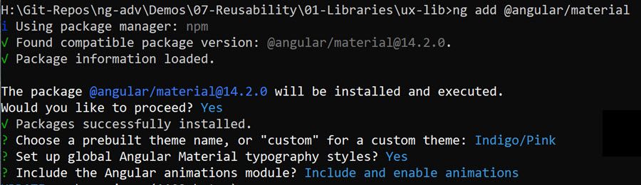

# Angular Libraries

[Angular Library Docs](https://angular.io/guide/libraries)

[Multible Projects - Angular File Structure](https://angular.io/guide/file-structure)

## Getting Started

Create a host project & Add Material & Flex Layout:

```
ng new ux-lib --routing --style scss
cd ux-lib
ng add @angular/material
npm i -S @angular/flex-layout
```

>Note: Use this settings when adding material:



Create Library:

```
ng g library ux-controls --prefix=ux
```

In `projects\ux-controls\lib\` delete the service `ux-controls.service.ts`, `ux-controls.component.ts` and its \*.spec-files. Remove it from `ux-controls.module.ts` and `public-api.ts`

### Implement a the Split Control

Implement a split component that divides the screen in a T-layout:

```
ng g c controls/split --project=ux-controls
```

>Note: The default stylesheet is *.css. You can change this behaviour by executing: 

```bash
ng config projects.ux-controls.schematics.@schematics/angular:component.style scss
```

Update `ux-controls.module.ts`:

```typescript
import { NgModule } from '@angular/core';
import { MatToolbarModule } from '@angular/material/toolbar';
import { FlexLayoutModule } from '@angular/flex-layout';
import { SplitComponent } from './controls/split/split.component';

const comps = [SplitComponent];

@NgModule({
  declarations: comps,
  imports: [MatToolbarModule, FlexLayoutModule],
  exports: comps,
})
export class UxControlsModule {}
```

>Note: The "ng g c ..." cli call does not register the component in the module. This must be done manually as seen above.

Update PeerDependencies in `package.json` of the library:

```typescript
"peerDependencies": {
    "@angular/common": "^14.2.0",
    "@angular/core": "^14.2.0",
    "@angular/animations": "^14.2.0",
    "@angular/flex-layout": "^14.0.0-beta.40",
    "@angular/material": "^14.2.0",
  },
```

> Note: You might want to change version numbers depending on the current versions

split.component.ts:

```typescript
import { Component, OnInit } from '@angular/core';

@Component({
  selector: 'ux-split',
  templateUrl: './split.component.html',
  styleUrls: ['./split.component.scss'],
})
export class SplitComponent  {
  toolbar = '100px';
  constructor() {}
}
```

split.component.html

```html
<div
  gdGap="0.5rem"
  gdAreas="title title | main toolbar"
  gdColumns="800px auto"
  gdRows="60px auto"
  class="container"
>
  <div gdArea="title" class="split-title">
    <mat-toolbar mat-dialog-title>
      <mat-toolbar-row>
        <ng-content select=".title"></ng-content>
      </mat-toolbar-row>
    </mat-toolbar>
  </div>
  <div gdArea="main" class="split-main">
    <ng-content select=".main"></ng-content>
  </div>
  <div gdArea="toolbar" class="split-sidebar">
    <ng-content select=".sidebar"></ng-content>
  </div>
</div>
```

split.component.scss:

```css
.container {
  min-height: 50vh;
  height: 100%;
}

.split-main {
  padding: 1rem;
}

.split-sidebar {
  padding: 1rem;
}
```

Modify `public-api.ts`:

```typescript
export * from './lib/controls/split/split.component';
export * from './lib/ux-controls.module';
```

Build Library:

```
ng build --project ux-controls
```

> Note: You could also run `ng build ux-controls` or use the `--watch` flag

### Use the Split Control

To use the Component import it in `app.module.ts` of you Main Project

```typescript
import { UxControlsModule} from "ux-controls"

@NgModule({
  ...
  imports: [
    ...
    UxControlsModule
  ],
  ...
})
export class AppModule { }
```

Add it to `app.component.ts` and run `ng s -o`:

```html
<ux-split>
  <div class="title">UX Split</div>
  <div class="main">Main Content</div>
  <div class="sidebar">Sidebar Buttons</div>
</ux-split>
```

Test the component:

```
ng serve -o --project ng-lib
```
### Publish Library to GitHub Packages

In your GitHub Account go to `Settings/Developer settings`, create an new token with `write:packages` and `delete:packages` and copy it afterwards:


Add an .npmrc to the folder of the lib:

```
@<GITHubUSERNAME>:registry=https://npm.pkg.github.com/
//npm.pkg.github.com/:_authToken=<TOKEN>
```

Build the project:

```
ng build -c production --project ux-controls 
```

Publish the lib from the folder of the lib:

```
npm publish
```

Check the result:


Go to the `Package settings` in the `Package Details` and change visibility to publish


### Use Library in another project

Create a new project:

```
ng new ux-lib-consumer --routing --style scss
```

Add an .npmrc:

```
@<GITHubUSERNAME>:registry=https://npm.pkg.github.com/
```

Install the package:

```
npm i -S @arambazamba/ux-controls@0.0.1
```