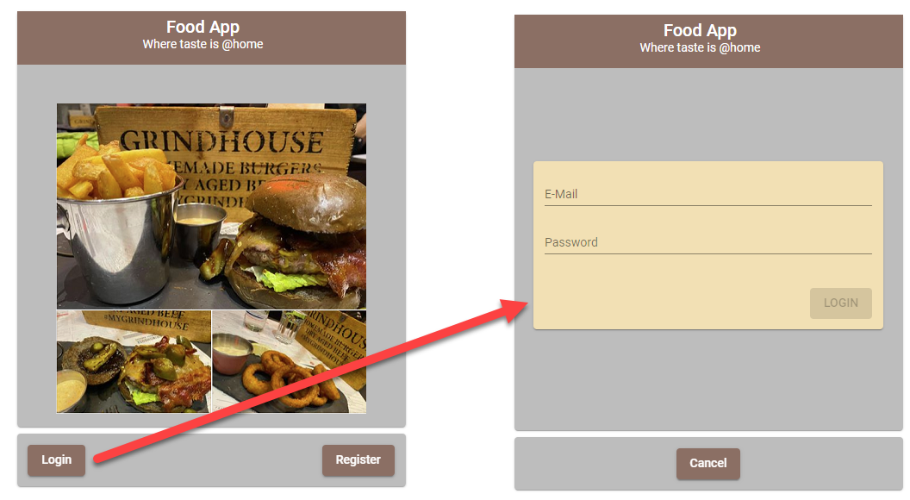

# Firebase Authentication using NgRx - Lab 4

## Implement Firbase Auth using NgRx

- Extend environment.ts to provide the Firebase Config
- Implement Firebase Loging & Register
- Modifiy `app.component.ts` to show a Login-Splash or the app

Example:

```html
<div *ngIf="(loggedIn$ | async) == true">
  <div>
    <app-navbar></app-navbar>
  </div>
  <div class="mainrow">
    <mat-sidenav-container style="width: 100%">
      <mat-sidenav
        #sidenav
        [opened]="menuVisible$ | async"
        [mode]="menuPosition$ | async"
        class="sidebar"
      >
        Sidenav content
      </mat-sidenav>
      <mat-sidenav-content class="workbench">
        <router-outlet></router-outlet>
      </mat-sidenav-content>
    </mat-sidenav-container>
  </div>
</div>

<div
  *ngIf="(loggedIn$ | async) == false"
  fxLayout="column"
  fxLayoutAlign="center center"
  class="loginsplash"
>
  <app-login-splash>
    <div class="login">
      <app-login></app-login>
    </div>
    <div class="register">
      <app-register></app-register>
    </div>
  </app-login-splash>
</div>
```

Sample Login Splash:


