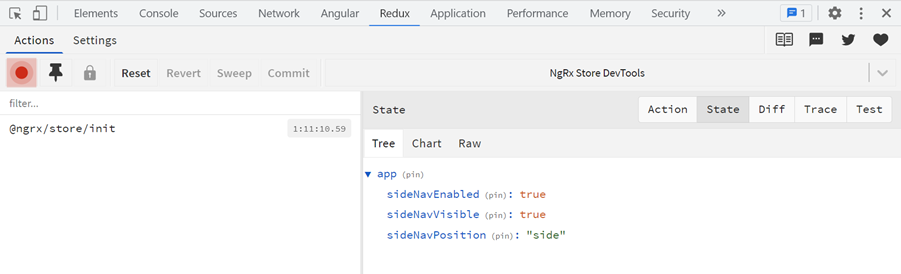

# Migrate Stateful Service to NgRx

## Tasks

- Refactor the "food"-folder to be a lazy loaded feature module 
- Refactor MenuService to use NgRx. You can take the demo app as a reference or use the guide below
- Migrate to NgRx the food module to use @ngrx/data. You can take https://github.com/arambazamba/ng-adv/tree/main/demos/04-state/tutorials/ngrx-data as a reference or use the guide below

## Guide: Getting Started with NgRx

NgRx installation:

```
npm i @ngrx/store @ngrx/effects @ngrx/entity @ngrx/data -S
npm i @ngrx/store-devtools -D
```

## Guide: Migrate MenuServie to NgRx

### 1. Create the store

Create a new folder called state inside the root folder and add the following code to index.ts:

```typescript
import { ActionReducerMap, MetaReducer } from '@ngrx/store';
import { environment } from '../../environments/environment';
import { appReducer, AppState } from './app.reducer';

export interface State {
  app: AppState;
}

export const reducers: ActionReducerMap<State> = {
  app: appReducer,
};

export const metaReducers: MetaReducer<State>[] = !environment.production
  ? []
  : [];
```

>Note: You might have an import error as the appReducer is not yet created. We will create it in the next steps.

Create the actions in `app.actions.ts`:

```typescript   
import { createAction, props } from '@ngrx/store';

export const setSideNavEnabled = createAction(
  '[Menu] changeSideNavEnabled',
  props<{ enabled: boolean }>()
);

export const toggleSideNav = createAction('[Menu] toggleSideNavVisible');

export const changeSideNavVisible = createAction(
  '[Menu] changeSideNavVisible',
  props<{ visible: boolean }>()
);

export const changeSideNavPosition = createAction(
  '[Menu] changeSideNavPosition',
  props<{ position: string }>()
);
```

Create the reducer in `app.reducer.ts`:

```typescript
import { createReducer, on } from '@ngrx/store';
import {
  changeSideNavPosition,
  changeSideNavVisible,
  setSideNavEnabled,
  toggleSideNav,
} from './app.actions';

export const appFeatureKey = 'app';

export interface AppState {
  sideNavEnabled: boolean;
  sideNavVisible: boolean;
  sideNavPosition: string;
}

export const initialAppState: AppState = {
  sideNavEnabled: true,
  sideNavVisible: true,
  sideNavPosition: 'side',
};

export const appReducer = createReducer(
  initialAppState,
  on(toggleSideNav, (state) => ({
    ...state,
    sideNavVisible: !state.sideNavVisible,
  })),
  on(setSideNavEnabled, (state, action) => ({
    ...state,
    sideNavEnabled: action.enabled,
    sideNavVisible: action.enabled,
  })),
  on(changeSideNavVisible, (state) => ({
    ...state,
    sideNavVisible: !state.sideNavVisible,
  })),
  on(changeSideNavPosition, (state, action) => ({
    ...state,
    sideNavPosition: action.position,
  }))
);
```

Create the selectors in `app.selectors.ts`:

```typescript
import { createFeatureSelector, createSelector } from '@ngrx/store';
import { appFeatureKey, AppState } from './app.reducer';

export const getAppState = createFeatureSelector<AppState>(appFeatureKey);

export const getSideNavVisible = createSelector(
  getAppState,
  (state: AppState) => state.sideNavVisible
);

export const getSideNavEnabled = createSelector(
  getAppState,
  (state: AppState) => state.sideNavEnabled
);

export const getSideNavPosition = createSelector(
  getAppState,
  (state: AppState) => state.sideNavPosition
);
```

Create a menu.facades.ts file and add the following code:

```typescript
import { Injectable } from '@angular/core';
import { MediaChange, MediaObserver } from '@angular/flex-layout';
import { Store } from '@ngrx/store';

import { combineLatest } from 'rxjs';
import { filter, map } from 'rxjs/operators';
import {
  changeSideNavPosition,
  changeSideNavVisible,
  setSideNavEnabled,
  toggleSideNav
} from './app.actions';
import { AppState } from './app.reducer';
import {
  getSideNavEnabled, getSideNavPosition, getSideNavVisible
} from './app.selector';

@Injectable({
  providedIn: 'root',
})
export class MenuFacade {
  constructor(
    private mediaObserver: MediaObserver,
    private store: Store<AppState>
  ) {
    this.init();
  }

  get sideNavEnabled() {
    return this.store.select(getSideNavEnabled);
  }

  get sideNavVisible() {
    return this.store.select(getSideNavVisible);
  }

  get sideNavPosition() {
    return this.store.select(getSideNavPosition);
  }

  private init() {
    combineLatest([
      this.mediaObserver.asObservable().pipe(
        filter((changes: MediaChange[]) => changes.length > 0),
        map((changes: MediaChange[]) => changes[0])
      ),
      this.sideNavEnabled,
    ]).subscribe(([change, enabled]) => {
      const visible = this.adjustSidenavToScreen(change.mqAlias);
      const position = this.adjustSidenavToScreen(change.mqAlias)
        ? 'side'
        : 'over';

      this.store.dispatch(changeSideNavPosition({ position }));
      this.store.dispatch(changeSideNavVisible({ visible }));
    });
  }

  setSideNavEnabled(enabled: boolean) {
    this.store.dispatch(setSideNavEnabled({ enabled }));
  }

  adjustSidenavToScreen(mq: string): boolean {
    switch (mq) {
      case 'xs':
        return false;
      case 'sm':
        return false;
      case 'md':
        return false;
      default:
        return true;
    }
  }

  toggleMenuVisibility() {
    this.store.dispatch(toggleSideNav());
  }
}
```

>Note: As `@angular/flex-layout` is in a deprecation state in future implementations you could use `@angular/cdk/layout` to detect the screen size.

Add the following modules and imports to `app.module.ts`:

```typescript
import { StoreModule } from '@ngrx/store';
import { StoreDevtoolsModule } from '@ngrx/store-devtools';
import { reducers } from './state';
import { environment } from 'src/environments/environment';

...

StoreModule.forRoot(reducers),
EffectsModule.forRoot([]),
EntityDataModule.forRoot({}),
StoreDevtoolsModule.instrument({
    logOnly: environment.production,
}),
```

Run the app and check the [Redux DevTools](https://chrome.google.com/webstore/detail/redux-devtools/lmhkpmbekcpmknklioeibfkpmmfibljd). You should see the initial state of the app.

